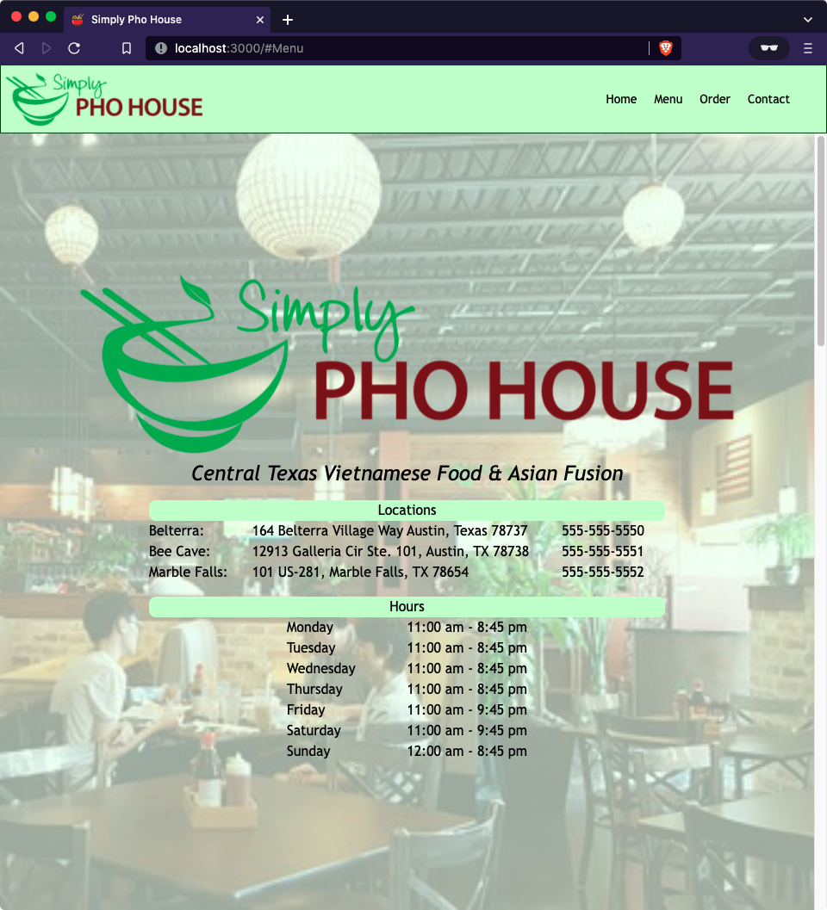

# Restaurant website made with ReactJS

<h1 align="center">
    <a href="https://restaurant-website-fremen432.netlify.app/" target="_blank">
     Live Page
    </a>
</h1>

    <!--  -->
    

## About 
Online restaurant website built with React.js intended for users to see information about the restaurant (i.e. locations, hours of operation, menu) and place orders.

Implemented dynamic elements to allow user to add items to cart featuring custom SCSS animations for Nav bar and drop-down menus.

Technologies used: 
- ReactJS
- Javascript
- SCSS
- React-icons